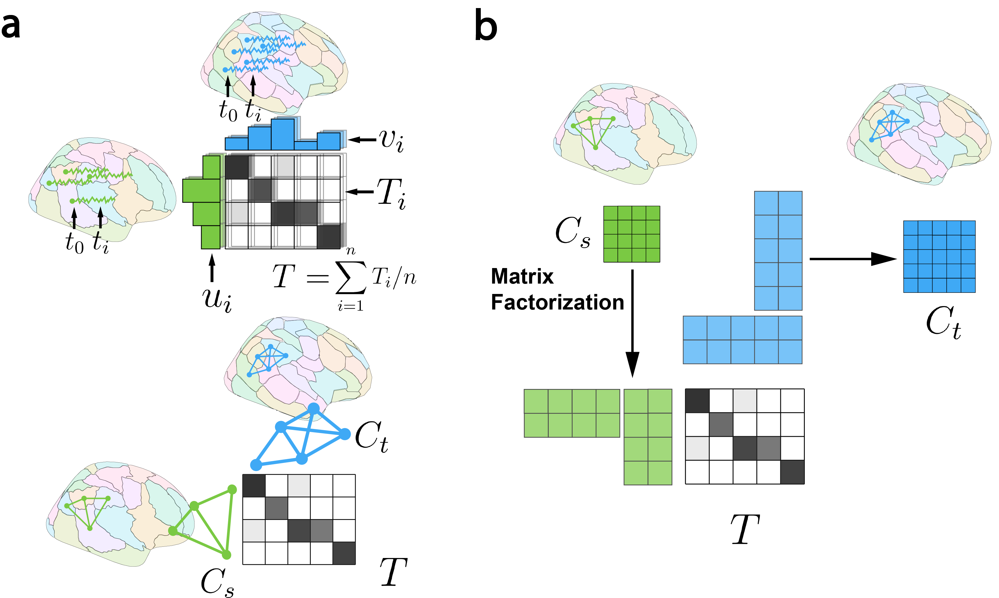

# Connectome-based Predictive Modeling with Missing Data 
Our manuscript is published at International Workshop on Graphs in Biomedical Image Analysis, MICCAI 2022 https://link.springer.com/chapter/10.1007/978-3-031-21083-9_12

## Method

Flowchart of our method. a, Learning mapping between atlases with optimal transport. Node-wise timeseries data yields transportation matrices at each timepoint, with the average providing the final mapping. When only connectomes are available, node mapping is learned through graph matching. b, Decomposing the source atlas connectome into node factors, transported to the target space using the mapping learned in a for estimating target connectomes.

## Dependencies
- python 3.9
- numpy
- scikit-learn
- POT
- SciPy

## Data
All the data should be configured in ./data/, all files should be name as {atlas}_{task}.mat
### learning the mapping
- functional mapping: ./data/mapping_time
- structural mapping: ./data/mapping_fc or ./data/mapping_sc
### data for application
- node timeseries: ./data/node_time
- connectomes: ./data/fc or ./data/sc


## Experiment 
You could set up your experiment like the example code below and run:
### Learn the mapping: 
#### functional mapping
```
python mapping_nodetime.py -s atlas_source -t atlas_target
```
#### structral mapping
```
python mapping_connectome.py -s atlas_source -t atlas_target
```

### Validation (using external datasets):
#### estimation accuracy
```
python Valid_recon.py -s atlas_source -t atlas_target -task task 
```

#### predictive performance (cross-validation)
```
python Valid_cv.py -s atlas_source -t atlas_target -sd seed 
```

## Reference
Liang, Q. et al. (2022). Transforming Connectomes to “Any” Parcellation via Graph Matching. In: Manfredi, L., et al. Imaging Systems for GI Endoscopy, and Graphs in Biomedical Image Analysis. ISGIE GRAIL 2022 2022. Lecture Notes in Computer Science, vol 13754. Springer, Cham. https://doi.org/10.1007/978-3-031-21083-9_12

Please cite our paper if you find this repository useful:
```
@InProceedings{10.1007/978-3-031-21083-9_12,
author="Liang, Qinghao and Dadashkarimi, Javid and Dai, Wei and Karbasi, Amin
and Chang, Joseph and Zhou, Harrison H. and Scheinost, Dustin", 
title="Transforming Connectomes to ``Any'' Parcellation via Graph Matching",
booktitle="Imaging Systems for GI Endoscopy, and Graphs in Biomedical Image Analysis",
year="2022",
publisher="Springer Nature Switzerland",
address="Cham",
pages="118--127",
isbn="978-3-031-21083-9"
}

```